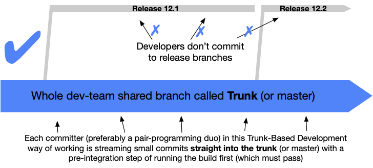

# Общепринятые практики
1. Python общепринято использовать # для комментариев в самом коде, когда нужно добавить пояснение к конкретной строке или части кода.
2. Многострочные строки в тройных кавычках  """. """ часто используются для документации и описания функций, методов и классов.

---
# Trunk Based Development
TBD - практика, когда работа всех команд ведется в одной ветке trunk. Весь код всех разработчиков сливается вместе и проверяется на наличие дефектов как можно раньше, автоматически.
2 варианта
* Без веток
  * Как в Google Doc
  * Интеграция в master как можно чаще
* С ветками
  * Как в Confluence
  * Ветки живут не больше 1 дня

Даже не до конца готовые фичи выходят в прод, но закрываются feature toggle.

[Сайт TBD](https://trunkbaseddevelopment.com)

## Работа по TBD.
1. Перед началом работы заберите последнюю версию master
    * *git checkout master*
    * *git pull*
1. Кодим
1. Комитим изменения в локальный репозиторий
    * *git add .*
    * *git commit -m "message"*
    * *git push*
4. Если не получается запушить 
    * *git pull*
5. Если есть конфликты, то их разрешаем и добавляем результаты
    * *git add .*
    * *git commit -m "message"*
    * *git push*
---

# Автотесты это ...
Автотест — это код, который автоматически проверяет, что код работает правильно с точки зрения пользователя.

# Сдвиг влево

# Материалы
* [Размышления о тестировании | less.works](https://less.works/ru/less/technical-excellence/thinking-about-testing)
* [Автоматизация тестирования | less.works](https://less.works/ru/less/technical-excellence/test-automation)
* [Модульные тесты | less.works](https://less.works/ru/less/technical-excellence/unit-testing)
* [Разработка через тестирование | less.works](https://less.works/ru/less/technical-excellence/test-driven-development)
* [Приемочное тестирование | less.works](https://less.works/ru/less/technical-excellence/acceptance-testing)
* [Статья на habr "Что такое качество. Разбираемся в иерархии терминов «QA», «QC» и «тестирование»"](https://habr.com/ru/company/rostelecom/blog/647963/)
* [A TDD Demonstration | Ron Jeffries](https://ronjeffries.com/articles/020-01ff/tdd-in-lua/)